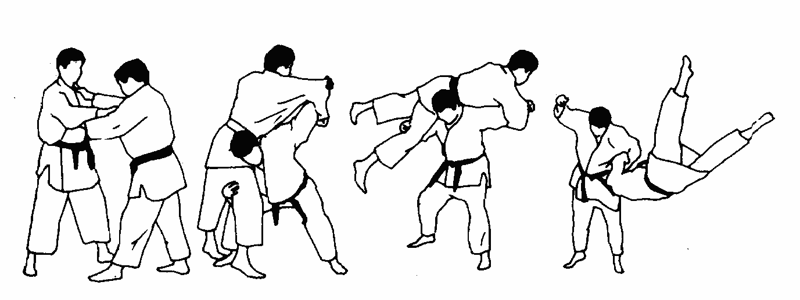

# Katas

**A kata, or code kata, is defined as an exercise in programming which helps hone your skills through practice and repetition.**

Other creative professions practice: artists carry a sketchpad, musicians play technical pieces, poets constantly rewrite works. In karate, where the aim is to learn to spar or fight, most of a student’s time is spent learning and refining basic moves. The more formal of these exercises are called kata.

To help developers get the same benefits from practicing, we’re putting together a series of code kata: simple, artificial exercises which let us experiment and learn without the external pressure.

## How To Practice Using Katas

Go one by one incrementally (by starting number) over the provided katas in this folder, create a new folder in format <kataname.version> in `katas` folder and create a new dotnet project(s) where you practice implementing the assignment.

### **Recommendation**

I recommend training katas in a set session (E.g.: Over a weekend, in X hours, ...).
If you do not finish the whole excersise, do not return to your previous implementation.
Create a new folder and start over. We are here to practice, not to finish a given assignment successfully.

## References

**[Ardalis Kata Catalog](https://github.com/ardalis/kata-catalog)** Recommended for .NET
[Awesome Katas](https://github.com/gamontal/awesome-katas)
